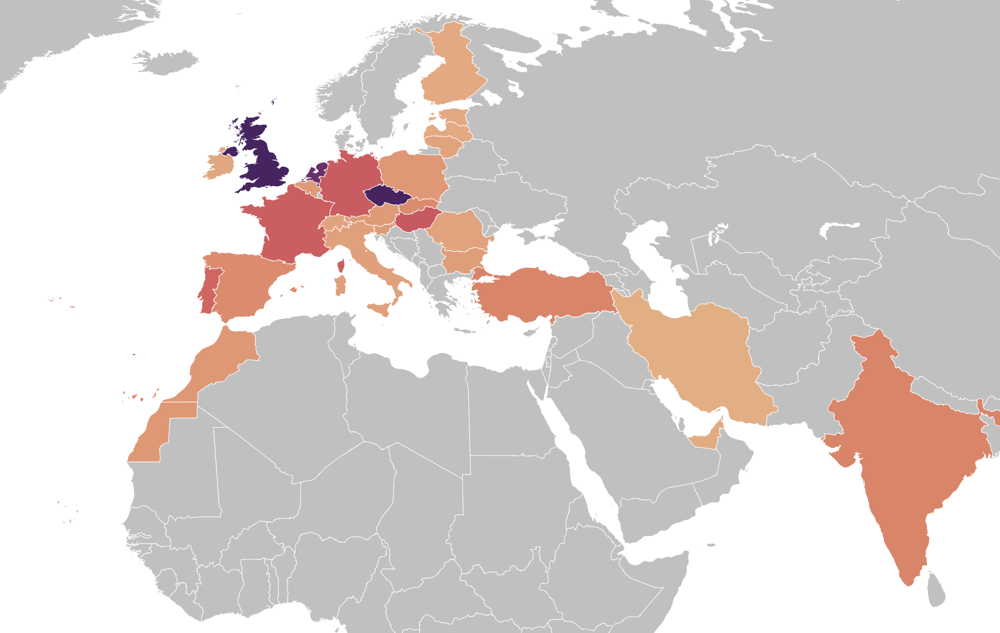
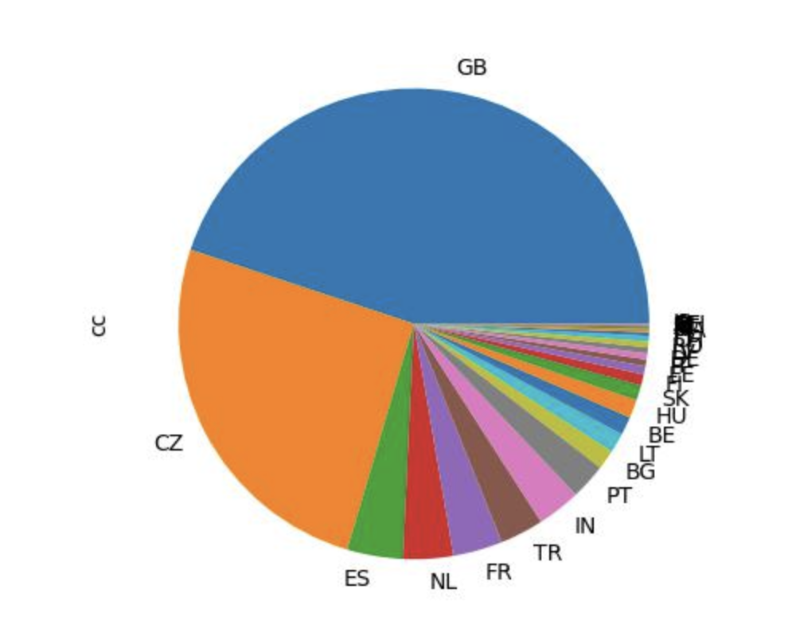
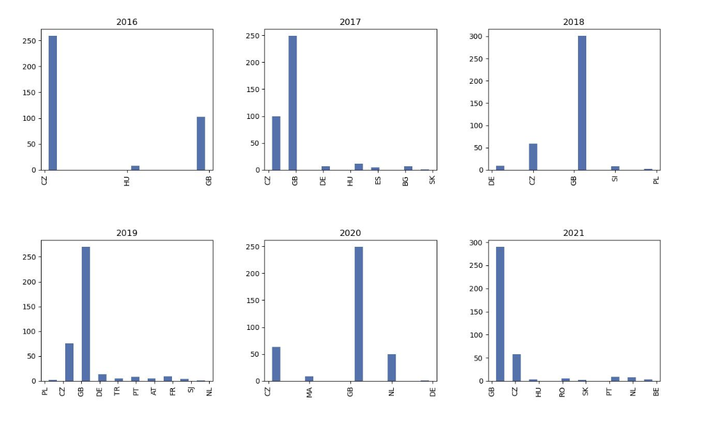
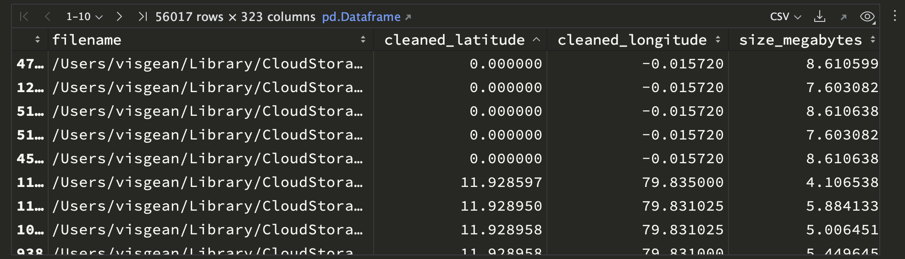

# Where - day by day location from your photos 

This scripts reads EXIF data from your photos and generates CSV file or Pandas dataframe with day by day location in terms of country. 

It relies on my package [exif2pandas](https://github.com/Visgean/exif2pandas/). It uses [reverse-geocoder](https://github.com/thampiman/reverse-geocoder) to convert GPS data to country codes. That module uses a csv file with 150k cities and then uses nearest neighbour algorithm to find the position of each gps data point. This sometimes does not work in border regions so if you are seeing bad data the easiest fix is to copy [cities.csv](https://github.com/Visgean/where/blob/main/src/cities.csv) and add your village etc. 

In case some of your photos contain bad gps data that show that you have been to countries where you have never been you can use ``ignore_countries`` argument. 

## world map



Generated world map with colored regions according to how many days you have spent in the country.

## Pie graph with number of days you spent in a country



## CSV file with your travel list:

``` 
id,from,to,days,country,country_code
4,2015-11-07,2015-11-09,1,Scotland,GB
5,2015-11-09,2015-12-12,32,Praha,CZ
6,2015-12-12,2015-12-12,0,Budapest,HU
7,2015-12-12,2015-12-12,0,Praha,CZ
8,2015-12-12,2015-12-15,2,Budapest,HU

```

note that the country column is usually wrong - this is because the cities.csv is not consisent with administrative boundaries beyond country_code. 

## Year by year histograms



## Raw dataframes:

Finally there is a raw dataframe with exif data per image file:




## Jupyter examples:

See ``example.ipynb`` for example graphs and data frames exported.

## Install:

See PYPI [Python package](https://pypi.org/project/photos-where/). 

```
$ pip install photos-where
```

## Use:

```
$ photos_where Dropbox/Photos/2020/
$ ls where
cities-pie.jpg      
countries-pie.jpg
intervals.csv
location-by-day.csv 
photos.feather     
years.jpg
```
